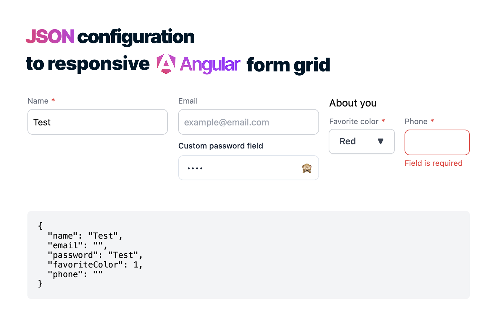

## 📚 Table of Contents

- [✅ Key Features](#-key-features)
- [📦 Installation](#-installation)
- [📌 Example Usage](#-example-usage)
- [🚀 Usage](#-usage)
  - [1️⃣ Add Styles to `angular.json`](#1️⃣-add-styles-to-angularjson)
  - [2️⃣ Basic Example of Usage](#2️⃣-basic-example-of-usage)
- [🌐 Using Aliases for Server-Provided JSON Configuration](#-using-aliases-for-server-provided-json-configuration)
  - [🔹 Example](#-example)
  - [🛠 Registering Aliases in `app.config.ts`](#-registering-aliases-in-appconfigts)
- [📏 Responsive Grid System (`colSize` Classes)](#-responsive-grid-system-colsize-classes)
  - [🔹 Column Sizing (1 to 12)](#-column-sizing-1-to-12)
  - [📏 Responsive Breakpoints](#-responsive-breakpoints)
- [📐 Grid System Configuration](#-grid-system-configuration)
  - [🔹 Default Grid Configuration](#-default-grid-configuration)
  - [🔹 Custom Grid Configuration (Tailwind, PrimeFlex, etc.)](#-custom-grid-configuration-tailwind-primeflex-etc)
- [📄 Defining Form Fields in an External File](#-defining-form-fields-in-an-external-file)
- [🛠 Built-in Example Fields & Custom Component Support](#-built-in-example-fields--custom-component-support)
- [📌 Field Types and Examples](#-field-types-and-examples)
  - [🔹 Example Usage of Each Field Type](#-example-usage-of-each-field-type)
  - [📌 InputField](#-inputfield)
  - [📌 SelectField](#-selectfield)
  - [📌 UIElement](#-uielement)
  - [📌 FieldGroup](#-fieldgroup)
  - [📌 GenericField](#-genericfield)

## ✅ Key Features

- 🔹 **Dynamic Form Rendering** – Generate Angular forms dynamically from JSON configuration.
- 🔹 **Responsive Grid System** – Automatically arranges form fields in a flexible grid layout.
- 🔹 **Supports Angular Reactive Forms** – Easily integrates with `FormGroup` and `FormControl`.
- 🔹 **Server-Driven Forms Support** – Fetch form configurations from an API and dynamically render fields.
- 🔹 **Alias-Based Component Mapping** – Use string-based aliases for `controlType` instead of direct component references.
- 🔹 **Custom Component Support** – Extend the form factory with your own form field components.
- 🔹 **Built-in Example Components** – Includes two test field components for quick setup and reference.
- 🔹 **Validation Handling** – Supports Angular’s `Validators` for real-time form validation.
- 🔹 **Field Grouping** – Nest multiple fields inside a single column to create complex forms.
- 🔹 **Event Emitters** – Listen to form changes, value updates, and submission events.
- 🔹 **Multi-Step Forms Support** – Allows building wizard-style step-based forms.
- 🔹 **Lightweight & Optimized** – Designed for performance, minimal dependencies, and easy integration.

## 📦 Installation

To install **ngx-dynamic-forms-factory**, run the following command in your Angular project:

```sh
npm install ngx-dynamic-forms-factory
```

## 📌 Example Usage

For a complete example of how to use **ngx-dynamic-forms-factory** in a real-world scenario, check out the example project:

🔗 **[Example Usage](https://github.com/martinstefanovic/angular-dynamic-forms/tree/master/projects/examples/src/app)**

## 🚀 Usage

### 1️⃣ Add Styles to `angular.json`

Before using the library, include the required styles in your `angular.json` file under the `styles` array:

```json
"styles": [
   "node_modules/ngx-dynamic-forms-factory/src/preflight.css",
   "node_modules/ngx-dynamic-forms-factory/src/styles.css",
  ...
]
```

### 2️⃣ Basic Example of Usage

Import the necessary components and services in your Angular component:

```typescript
// your-angular-component.compontnt.ts

import { FormFactoryComponent, FormFactoryService } from 'ngx-dynamic-forms-factory';
import jsonFormExample from './json-form-example';

@Component({
  selector: 'app-root',
  imports: [FormFactoryComponent, CommonModule],
  template: `
    <main>
      <ngx-form-factory [form]="form" [formFields]="formFields()" />
    </main>

    <pre>
      {{ form.getRawValue() | json }}
    </pre
    >
  `,
})
export class AppComponent {
  form!: FormGroup;
  formFields = signal<any[]>([]);
  formFactory = inject(FormFactoryService);

  ngOnInit(): void {
    this.form = this.formFactory.createForm(jsonFormExample);
    this.formFields.set(jsonFormExample);
  }
}
```

## 🌐 Using Aliases for Server-Provided JSON Configuration

If you need to **provide form JSON configuration from a server API**, you can use **aliases** for `controlType` instead of directly referencing component classes.

### 🔹 Example:

Instead of:

```typescript
{
  "controlType": InputFieldComponent
}
```

You can use:

```json
{
  "controlType": "input"
}
```

This allows you to dynamically map string-based aliases to your components.

### 🛠 Registering Aliases in app.config.ts

To define aliases and their corresponding components, use provideFormFactoryConfig in your app configuration:

```typescript
import { provideFormFactoryConfig } from 'ngx-dynamic-forms';
import { MyCustomInputComponent } from './components/my-custom-input.component';

export const appConfig = {
  providers: [
    provideFormFactoryConfig({
      aliases: [{ component: MyCustomInputComponent, alias: 'input' }],
    }),
  ],
};
```

With this setup, any field with "controlType": "input" will automatically be rendered using MyCustomInputComponent.

This approach is useful when working with server-driven forms, allowing you to configure forms dynamically without modifying frontend code.

## 📏 Responsive Grid System (`colSize` Classes)

The `colSize` property controls how form fields are positioned in a **responsive grid layout**. It follows a **12-column grid system**, like **Tailwind CSS**, but uses the prefix **`ui-`**.

### **🔹 Column Sizing (1 to 12)**

Each field can span between **1 and 12 columns** in the grid.

| **Class**        | **Effect**                                             |
| ---------------- | ------------------------------------------------------ |
| `ui-col-span-1`  | The field spans **1** grid column.                     |
| `ui-col-span-2`  | The field spans **2** grid columns.                    |
| `ui-col-span-3`  | The field spans **3** grid columns.                    |
| `ui-col-span-4`  | The field spans **4** grid columns.                    |
| `ui-col-span-5`  | The field spans **5** grid columns.                    |
| `ui-col-span-6`  | The field spans **6** grid columns (half of the grid). |
| `ui-col-span-7`  | The field spans **7** grid columns.                    |
| `ui-col-span-8`  | The field spans **8** grid columns.                    |
| `ui-col-span-9`  | The field spans **9** grid columns.                    |
| `ui-col-span-10` | The field spans **10** grid columns.                   |
| `ui-col-span-11` | The field spans **11** grid columns.                   |
| `ui-col-span-12` | The field takes the **full width** (12 columns).       |

---

### **📏 Responsive Breakpoints**

You can make the field **adjust dynamically** across different screen sizes by adding **responsive prefixes**:

| **Breakpoint**  | **Prefix** | **Example**                                           |
| --------------- | ---------- | ----------------------------------------------------- |
| **Small**       | `sm:`      | `sm:ui-col-span-6` (6 columns on small screens)       |
| **Medium**      | `md:`      | `md:ui-col-span-4` (4 columns on medium screens)      |
| **Large**       | `lg:`      | `lg:ui-col-span-3` (3 columns on large screens)       |
| **Extra Large** | `xl:`      | `xl:ui-col-span-2` (2 columns on extra-large screens) |

---

## 📐 Grid System Configuration

By default, this library **uses a 12-column grid system** to organize form fields in a **responsive layout**. The grid system applies to both **main forms** and **nested field groups**.

---

### **🔹 Default Grid Configuration**

The default grid system uses **12 columns** and applies spacing between elements:

```typescript
grid: {
  mainGridClassess: 'ui-grid ui-grid-cols-12 ui-gap-x-4 ui-gap-y-2',
  nestedGridClassess: 'ui-grid ui-grid-cols-12 ui-gap-x-4 ui-gap-y-2',
}
```

🏗 `mainGridClassess`→ Defines the grid layout for the entire form.
📦 `nestedGridClassess` → Defines the grid layout for nested field groups inside the form.
🔹 `ui-grid-cols-X` → X-column grid system (X can be number from 1 to 12).
🔹 `ui-gap-x-4` → Horizontal spacing between columns.
🔹 `ui-gap-y-2` → Vertical spacing between rows.

### **🔹 Custom Grid Configuration (Tailwind, PrimeFlex, etc.)**

If you do not want to use the library’s built-in grid system and prefer using Tailwind CSS, PrimeFlex, or another utility-based grid, you can override the default grid configuration.

Modify your app.config.ts to provide your custom grid classes:

```typescript
import { provideFormFactoryConfig } from 'ngx-dynamic-forms-factory';

export const appConfig = {
  providers: [
    provideFormFactoryConfig({
      grid: {
        mainGridClassess: 'grid grid-cols-10 gap-2', // Custom Tailwind
        nestedGridClassess: 'grid grid-cols-6 gap-x-4 gap-y-2',
      },
    }),
  ],
};
```

If you override the grid system, you do not need the library’s CSS styles anymore.
You can remove the default styles from `angular.json`.

## 📄 Defining Form Fields in an External File

To keep the form configuration modular and reusable, define the form fields in an **external file**. The fields are created using the `createField` function and exported as an array.

### **Example: `json-form-example.ts`**

Create a file named `json-form-example.ts` and add the following:

```typescript
import { Validators } from '@angular/forms';
import { createField, InputField } from 'ngx-dynamic-forms-factory';

export default [
  createField<InputField>({
    colSize: 'ui-col-span-12 sm:ui-col-span-4',
    controlType: InputField,
    label: 'Name',
    placeholder: 'Enter name',
    type: 'text',
    options: {
      formControlName: 'name',
      value: 'Test',
      disabled: false,
      validators: [Validators.minLength(3), Validators.required, Validators.maxLength(10)],
    },
  }),
];
```

## 🛠 Built-in Example Fields & Custom Component Support

This library provides **two example field components** intended for **testing and demonstration purposes**.

If you want to **add your own custom components**, you can check out the example implementation here:
🔗 **[Custom Components Example](https://github.com/martinstefanovic/angular-dynamic-forms/tree/master/projects/examples/src/app/components/input-password)**

This guide explains how to create and register **custom form components** to extend the functionality of `ngx-dynamic-forms-factory`. Also you can see how to implement error handling and manual value updating without formControlName.

## 📌 Field Types and Examples

The `createField` function is used to create form fields based on different interfaces. Below is a table of available field types and their descriptions.

| **Interface**      | **Description**                                                           |
| ------------------ | ------------------------------------------------------------------------- |
| **`InputField`**   | EXAMPLE FIELD! Standard text input field with validation and placeholder. |
| **`SelectField`**  | EXAMPLE FIELD! Dropdown select field with predefined options.             |
| **`UIElement`**    | Used to insert a custom UI component into the form.                       |
| **`FieldGroup`**   | Groups multiple fields together in a single column in the grid layout.    |
| **`GenericField`** | Base interface for extending and creating custom fields.                  |

---

### **🔹 Example Usage of Each Field Type**

#### **📌 InputField**

```typescript
import { Validators } from '@angular/forms';
import { createField, InputField } from 'ngx-dynamic-forms-factory';

[
    createField<InputField>({
    colSize: 'ui-col-span-12 sm:ui-col-span-4',
    controlType: InputField,
    label: 'Name',
    placeholder: 'Enter name',
    type: 'text',
    options: {
        formControlName: 'name',
        value: '',
        validators: [Validators.required, Validators.minLength(3)],
    },
    });
    ... // Other fields
]
```

#### **📌 SelectField**

```typescript
import { createField, SelectField } from 'ngx-dynamic-forms-factory';

[
    createField<SelectField>({
    colSize: 'ui-col-span-12 sm:ui-col-span-4',
    controlType: SelectField,
    label: 'Country',
    selectOptions: [
        { id: 'us', name: 'United States' },
        { id: 'ca', name: 'Canada' },
    ],
    selectValue: 'id',
    selectLabel: 'name',
    options: {
        formControlName: 'country',
        value: '',
        validators: [],
    },
    });
    ... // Other fields
]
```

#### **📌 UIElement**

```typescript
import { createField, UIElement } from 'ngx-dynamic-forms-factory';
import { CustomTitleComponent } from './custom-title.component';

[
    createField<UIElement>({
    colSize: 'ui-col-span-12',
    controlType: CustomTitleComponent,
    data: { title: 'Personal Information' },
    })
    ... // Other fields
]
```

#### **📌 FieldGroup**

```typescript
import { createField, FieldGroup, InputField } from 'ngx-dynamic-forms-factory';

[
    createField<FieldGroup>({
    colSize: 'ui-col-span-12 sm:ui-col-span-4',
    group: [
        createField<InputField>({
        colSize: 'ui-col-span-12',
        controlType: InputField,
        label: 'Email',
        placeholder: 'example@email.com',
        type: 'email',
        options: {
            formControlName: 'email',
            value: '',
            validators: [Validators.email, Validators.required],
        },
        }),
        ... // Other fields
    ],
    })
    ... // Other fields
]
```

#### **📌 GenericField**

```typescript
import { createField, GenericField } from 'ngx-dynamic-forms-factory';

interface CustomToggleField extends GenericField {
  myCustomOption: string;
}
```
