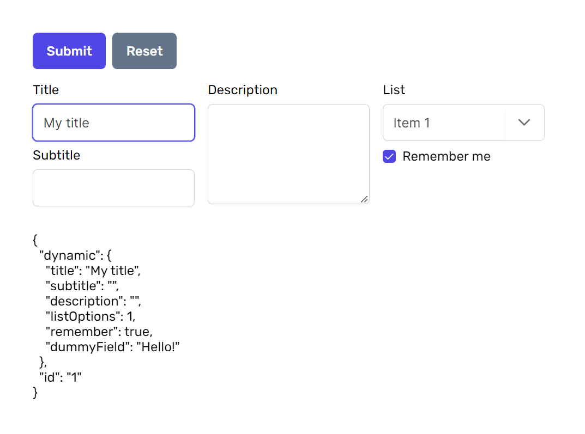

# Angular Dynamic Forms

Angular component that allows the creation of dynamic forms. You can use this component in situations where you get the configuration for the form from an external API or if you just hate HTML 😀



## List of features

> `UI Style` — for UI i used [PrimeNG](https://www.primefaces.org/primeng/#/) but you can use any Angular UI Library.

- Dynamically created form only from JSON configuration
- Full gird layout for forms
- Dummy fields without UI input fields
- You can group fields in same column
- Validation error messages
- Responsive forms
- 👇 Easy to [add more supported fields](#add-more-fields)

#### Supported fields by default

> You can add more by yourself!

| Field      | Selector / `controlType`   | Description |
| ---------- | -------------------------- | ----------- |
| Input      | `input`                    | Text input field.
| Textarea   | `textarea`                 | Textarea field.


## Installation

Clone repo and run:

```shell
npm install
```

```shell
ng serve -o
```


## Usage

There are two ways you can use dynamic forms. The first way is if you have no additional controls other than those in the configuration.

#### Example 1 

```typescript
  constructor(
    public formFactory: FormBuilderService
  ) {}

  ngOnInit(): void {
    /**
    * Call formFactory service and pass form fields
    * JSON configuration to create new form group
    */
    this.exampleForm = this.formFactory.createForm(this.exampleFields);
    /**
    * Example how to add additional formControl
    * to form ifyou need
    */
    this.exampleForm.addControl('id', new FormControl(1, Validators.required));
  }
```

```HTML
  <app-form-factory
    [form]="exampleForm"
    [fields]="exampleFields"
  ></app-form-factory>
```

#### Example 2

If you want to insert dynamic fields into one control and add the rest of the field via the form builder, you can do so as follows.

```typescript
  constructor(
    private fb: FormBuilder,
    public formFactory: FormBuilderService
  ) {}

  ngOnInit(): void {
    this.exampleForm = this.fb.group({
      dynamic: this.formFactory.createForm(this.exampleFields),
      id: ['1', Validators.required],
    });
  }
```

```HTML
  <app-form-factory
    [form]="formFactory.getFormGroup(exampleForm,'dynamic')"
    [fields]="exampleFields"
  ></app-form-factory>
```

## Available configuration

### Enabling / disabling fields

This system supports some form fields by default (see above). If you want to specify fields you would like to use you can do that in `form-factory/core/services/form-builder.service.ts`:

```typescript
  private formFields: FieldTypeModel[] = [
    {
      type: 'input',
      component: InputComponent,
    },
    {
      type: 'textarea',
      component: TextareaComponent,
    },
    ...
  ];
```

> Note that if you want you can pass any form field you created like in example above.

> `type` - Selector that you use for `controlType` option in JSON configuration.

> `component` - Angular component

### Add more services

You can provide your own services using simple configuration.

First, you should create a Service configuration object. It contains following fields:

| Field      | Type       | Description |
| ---------- | ---------- | ----------- |
| `regex`    | `RegExp`   | Pattern of pasted URLs. You should use regexp groups to extract resource id
| `embedUrl` | `string`   | Url of resource\`s embed page. Use `<%= remote_id %>` to substitute resource identifier
| `html`     | `string`   | HTML code of iframe with embedded content. `embedUrl` will be set as iframe `src`
| `height`   | `number`   | _Optional_. Height of inserted iframe
| `width`    | `number`   | _Optional_. Width of inserted iframe
| `id`       | `Function` | _Optional_. If your id is complex you can provide function to make the id from extraced regexp groups

Example:

```javascript
{
  regex: /https?:\/\/codepen.io\/([^\/\?\&]*)\/pen\/([^\/\?\&]*)/,
  embedUrl: 'https://codepen.io/<%= remote_id %>?height=300&theme-id=0&default-tab=css,result&embed-version=2',
  html: "<iframe height='300' scrolling='no' frameborder='no' allowtransparency='true' allowfullscreen='true' style='width: 100%;'></iframe>",
  height: 300,
  width: 600,
  id: (groups) => groups.join('/embed/')
}
```

When you create a Service configuration object, you can provide it with Tool\`s configuration:

```javascript
var editor = EditorJS({
  ...

  tools: {
    ...
    embed: {
      class: Embed,
      config: {
        services: {
          youtube: true,
          coub: true,
          codepen: {
            regex: /https?:\/\/codepen.io\/([^\/\?\&]*)\/pen\/([^\/\?\&]*)/,
            embedUrl: 'https://codepen.io/<%= remote_id %>?height=300&theme-id=0&default-tab=css,result&embed-version=2',
            html: "<iframe height='300' scrolling='no' frameborder='no' allowtransparency='true' allowfullscreen='true' style='width: 100%;'></iframe>",
            height: 300,
            width: 600,
            id: (groups) => groups.join('/embed/')
          }
        }
      }
    },
  },

  ...
});
```

#### Inline Toolbar
Editor.js provides useful inline toolbar. You can allow it\`s usage in the Embed Tool caption by providing `inlineToolbar: true`.

```javascript
var editor = EditorJS({
  ...

  tools: {
    ...
    embed: {
      class: Embed,
      inlineToolbar: true
    },
  },

  ...
});
```

## Output data

| Field   | Type     | Description
| ------- | -------- | -----------
| service | `string` | service unique name
| source  | `string` | source URL
| embed   | `string` | URL for source embed page
| width   | `number` | embedded content width
| height  | `number` | embedded content height
| caption | `string` | content caption


```json
{
  "type" : "embed",
  "data" : {
    "service" : "coub",
    "source" : "https://coub.com/view/1czcdf",
    "embed" : "https://coub.com/embed/1czcdf",
    "width" : 580,
    "height" : 320,
    "caption" : "My Life"
  }
}
```

# About CodeX


CodeX is a team of digital specialists around the world interested in building high-quality open source products on a global market. We are [open](https://codex.so/join) for young people who want to constantly improve their skills and grow professionally with experiments in cutting-edge technologies.

| 🌐 | Join  👋  | Twitter | Instagram |
| -- | -- | -- | -- |
| [codex.so](https://codex.so) | [codex.so/join](https://codex.so/join) |[@codex_team](http://twitter.com/codex_team) | [@codex_team](http://instagram.com/codex_team) |
